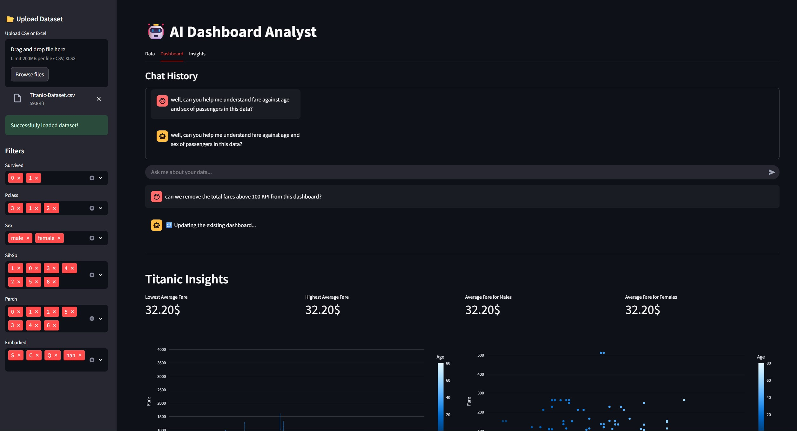

# 🤖 AI Dashboard Analyst

AI Dashboard Analyst is an interactive, LLM-powered dashboarding assistant. Upload any tabular dataset, and the agent can:

- Suggest dashboards (charts & KPIs) tailored to your questions
- Revise existing dashboards based on your instructions
- Provide explanations and reasoning behind the chosen visualizations

----------------------------------------------------------------------------------------------------------------

## Features

- **Agentic workflow:** Ask questions, clarify ambiguities, and update dashboards interactively
- **LLM-powered dashboard design:** Suggests charts and KPIs based on your dataset and query
- **Reasoning:** Understand why certain charts or KPIs were chosen
- **Interactive UI:** Streamlit interface with separate tabs for Dataset, Dashboard, and Insights
- **Clarification layer:** Handles vague questions by asking pinpointed follow-ups
- **Supports CSV & Excel datasets**

---------------------------------------------------------------------------------------------------------------

## 📸 Demo

  

-----------------------------------------------------------------------------------------------------------

## Installation

1. Clone the repo:

```bash
git clone https://github.com/yourusername/ai-dashboard-analyst.git
cd ai-dashboard-analyst
```
2. Create virtual environment if required and install dependencies
3. Have Ollama running locally on your device (model set to your preference, used llama3.1 here)
4. Run the app using
```bash
streamlit run app.py
```

----------------------------------------------------------------------------------------------------

## 🧠 How It Works

1. Upload a dataset (CSV or Excel)
2. Ask questions in the chat window about the dataset
3. The agent may:
   - Ask clarification questions if your query is vague
   - Generate a dashboard with charts and KPIs
   - Provide textual insights explaining the dashboard
4. You can revise the dashboard by asking follow-up questions or tweaking chart/KPI selections

-----------------------------------------------------------------------------------------------------

## Future Improvements

- Allow text-only answers when a dashboard is not necessary
- Support more advanced analytics (correlations, trends, anomaly detection)
- Multi-tab dashboards for deeper exploratory analysis
- Add more interactive controls (filtering, drill-downs, etc.)


